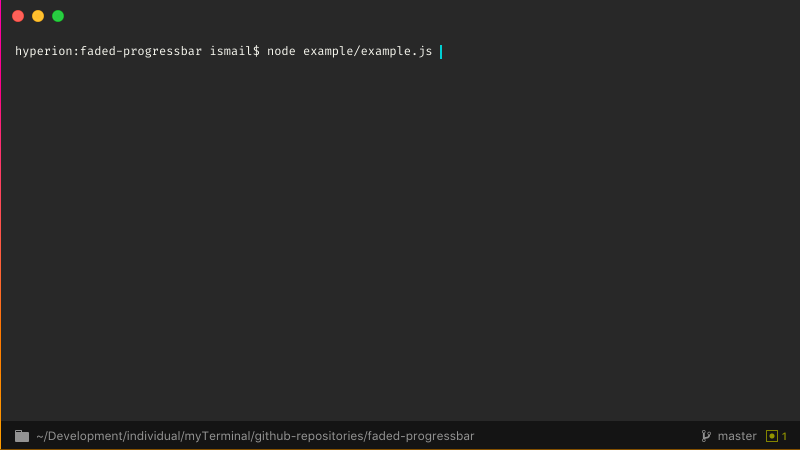

# faded-progressbar

  

    

A simple, light-weight and customizable progress bar for command-line applications

## Features

* Easy to use with only a few methods.

## How to Use

Simply do a `require` and create a process as

    var fadedProgressbar = require('faded-progressbar');
    var newProcess = fadedProgressbar.newProcess("Some long running process", 20);

The first argument is the process title that is to be displayed on the console, the second is the total number of sub-tasks in the process.

To print the start of the process, simply invoke `start()`.

    newProcess.start();

When the process progresses (in small steps), invoke `updateProgress()` passing in the new progress number.

    newProcess.updateProgress(15);

When the process ends, invoke `end()` which prints *100%* against the process title and shows a completed progress bar.

    newProcess.end();
    
You are free to use the console to print any logs while a process is active, *faded-progressbar* takes care of maintaining a single progress bar at the end of the console automatically.

By default, the package replaces the default `console.log()` method with an internal one, which is almost the same but with a few extra functionalities. You can turn this feature off by invoking `unmaskLogs()`.

    fadedProgressbar.unmaskLogs();

Once turned off, you would be able to use the default `console.log()` again. This should not be required in usual cases though.

You can also enable the feature with the exact opposite method: `maskLogs()`.
    
## To-do

* Customizable progress bar character
* Animations
